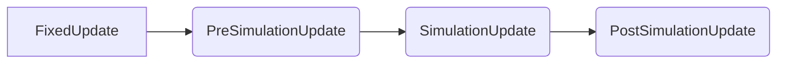

# KCC Update loop
If “Auto Simulation” is enabled in the plugin settings, the following execution order will happen:

If “Auto simulation” is disabled, it is up to you as the developer to call the above functions manually.

During these the following Actions are called (if any attached) from the KCC plugin:

* `PreSimulationUpdateEvent`: At the very beginning of the call, before `InitialPosition`/`InitialOrientation` are assigned from `TransientPosition`/`TransientOrientation`.
* “SimulationUpdate”: At the very beginning of the call, before all movers and characters are processed.
* “PostSimulationUpdate”: At the very end of the call, after necessary interpolation info is set up.

If “Interpolate” is enabled in the plugin settings, the plugin will automatically interpolate all KCC registered Actors, allowing you to run the game at a lower physics tick rate. If disabled it is up to you as the developer to call the function `InterpolationUpdate` manually if interpolation is wanted.

> [!CAUTION]
> With the current state of flax, interpolation is disconnect from the actual render event. This will be fixed in the future once the PR gets pulled, but as it stands currently you may experience a 1 frame delay when setting an objects position to a KCC actor's position through a script instead of using the scene hierarchy to do parenting.